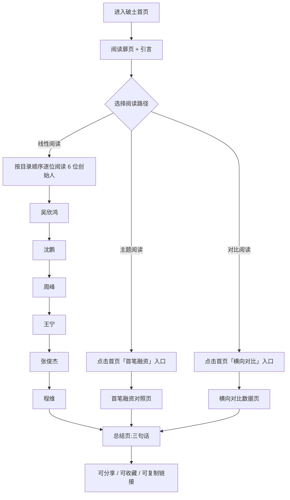

# 破土｜中国新消费与互联网创业者全景志

## 1. 产品概述

**破土｜中国新消费与互联网创业者全景志** 是一个面向迷茫创业者的内容型长读网站。通过对六位中国新经济领域代表性创始人（吴欣鸿、沈鹏、周峰、王宁、张俊杰、程维）的「个人经历—首轮融资—后续融资—公司发展」四象限全景记录,剖析影响创业成败的深层因素,以严肃而克制的编辑设计语言,赋能正在路上的创业者。

- 核心问题:为什么有些公司能成为大厂,有些公司甚至失败?首笔投资怎么拿?后续融资如何滚雪球?创始人的个人经历如何反作用于公司命运?
- 目标用户:早期创业者、连续创业者、产品/商业从业者、商科学生。
- 产品价值:为「迷茫的创业者」提供一份冷静、可读、可对照的案头书,让数据与故事并列,让灵感与教训齐飞。

## 2. 核心功能

### 2.1 内容架构
六大创始人模块 + 一个全局对比模块,共七大内容板块:
1. **吴欣鸿 × 美图秀秀** —— 工具型产品的「审美红利」
2. **沈鹏 × 水滴筹** —— 互联网保险的「信任难题」
3. **周峰 × 鱼泡直聘** —— 蓝领招聘的「脏活赛道」
4. **王宁 × 泡泡玛特** —— IP 商业的「无中生有」
5. **张俊杰 × 霸王茶姬** —— 新茶饮的「农村包围城市」
6. **程维 × 滴滴** —— 平台经济的「烧钱修罗场」
7. **横向对比:首笔融资的六种打开方式** —— 全局数据可视化与归纳

### 2.2 页面与模块
| 页面 | 模块 | 功能描述 |
|------|------|----------|
| 首页(破土扉页) | Hero 扉页 | 标题、引言、六位创始人名字的画廊式陈列 |
| | 目录导航 | 锚点跳转至各创始人专题 |
| 创始人专题页(6 个) | 人物扉页 | 大字号姓名 + 公司 + 关键数据牌(估值/上市/用户数) |
| | 个人经历 | 童年/教育/早期项目/性格特征 |
| | 首轮融资 | 怎么拿到第一笔钱:谁投的?为什么投?金额? |
| | 后续融资时间线 | A→B→C→IPO 的可滚动时间线,标注每轮投资人、金额、估值 |
| | 公司发展纪事 | 关键节点:成立、转型、爆款、危机、出海、上市 |
| | 教训与启示 | 三个编辑提炼的「这件事教给我们」 |
| 横向对比页 | 首笔融资对照表 | 6 位 × 投资人/金额/估值/动机 的并排卡片 |
| | 融资节奏条 | 横向 6 列时间轴,标注每家每轮融资时间点 |
| | 行业分布 | 工具 / 保险 / 招聘 / IP / 茶饮 / 出行 的赛道划分 |
| | 影响因素归纳 | 时代、赛道、团队、运气、资本,五大变量 |
| 总结页 | 「给迷茫创业者的三句话」 | 收束全篇 |

### 2.3 交互与动效
- 长文式滚动 + 锚点导航
- 融资时间线横向滚动,鼠标悬停展开该轮详情卡
- 关键数字采用「滚动到可视区后从 0 滚动到目标值」的计数动画
- 章节切换有过渡(向下出现/向上消失)
- 顶部固定导航条 + 侧边目录指示当前阅读位置

## 3. 核心流程

## 4. 用户界面设计

### 4.1 设计风格
- **主题色**(克制,接近杂志感):
  - 底色:深墨黑 `#0d0d0f`、暖白 `#f4ede1`
  - 强调色:古铜金 `#c9a961`、朱砂红 `#b94a3d`、墨青 `#2f4a3a`
  - 文字:暖白 `#f5f1e8`、次级灰 `#a8a39a`、分割线 `#3a3733`
- **字体选择**(避免 Inter / 思源黑体这种烂大街):
  - 中文标题:`Noto Serif SC` (重)+ `ZCOOL XiaoWei` (轻),营造书卷气
  - 中文正文:`Noto Serif SC` Regular,杂志长文阅读体验
  - 数字/英文:`DM Serif Display` (大数字)+ `JetBrains Mono` (数据标签)
- **按钮/标签**:细线边框 + 金色细描边,无圆角或极小圆角
- **布局风格**:以 12 列网格为基础,留白充裕;首屏不堆叠,采用杂志式大字 + 极少元素 + 大量呼吸
- **图标**:极少使用,只在导航/章节标号等关键位置点缀 `lucide-react` 图标
- **分割元素**:金线、双横线、中式「」引号、章回体序号

### 4.2 页面设计概述
| 页面 | 模块 | UI 元素 |
|------|------|---------|
| 扉页 | Hero | 巨号衬线字「破土」+ 副标题 + 六位创始人名字分两行错落排版,搭配朱砂红章回体数字 |
| 扉页 | 目录 | 单列文字,每项右侧标注页码风格数字,悬停时金色下划线滑入 |
| 创始人专题 | 扉页 | 左侧大数字(01-06)+ 公司 Logo 占位 + 右侧中文大标题 + 关键数据三栏 |
| 创始人专题 | 个人经历 | 段落 + 关键事件金色边线 pull-quote,间杂时间数字 |
| 创始人专题 | 融资时间线 | 横向时间轴,节点用金圆+朱砂数字,悬停弹卡显示投资人/金额/估值 |
| 创始人专题 | 发展纪事 | 纵向卡片列表,左右交错,每张卡左上角金色年份 |
| 横向对比 | 融资对照 | 6 列网格,每列一个创始人,内容分块对齐 |
| 横向对比 | 行业分布 | 六大色块配赛道名 + 一句概括 |
| 总结 | 三句话 | 巨型衬线字 + 极简,营造仪式感 |

### 4.3 响应性
- 桌面优先(1280+ 宽屏最佳),以杂志阅读体验为目标
- 平板 (768-1024):双列变单列,时间线纵向
- 手机 (< 768):全部单列,导航折叠为顶部抽屉

### 4.4 动效指引
- 章节切换:IntersectionObserver 触发,标题和正文错峰淡入
- 融资节点:进入视口时数字滚动 + 节点弹跳
- 滚动到底部:朱砂印章式「END」标记落下
- 全局:无大面积 parallax,克制即高级

## 5. 内容素材来源
公开资料整理:百度百科、36氪、虎嗅、晚点 LatePost、第一财经、招股书、公开演讲与访谈。所有内容为编辑综合梳理,无虚构,仅做信息密度优化。
