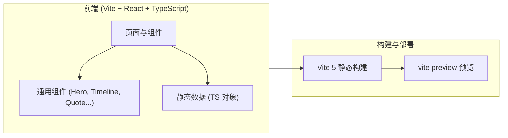

# 技术架构文档

## 1. 架构设计



采用纯静态站点架构。所有内容以 TypeScript 对象形式内联在 `src/data/` 中,前端组件直接消费,无后端、无数据库、无外部服务依赖。

## 2. 技术描述

- **前端框架**:React 18 + TypeScript
- **构建工具**:Vite 5
- **样式方案**:Tailwind CSS 3 + 自定义 CSS 变量(深墨主题)
- **字体**:Google Fonts (Noto Serif SC, ZCOOL XiaoWei, DM Serif Display, JetBrains Mono)
- **路由**:单页 + 锚点导航(无 react-router,内容为长读)
- **状态管理**:无(纯展示)
- **图标**:lucide-react
- **动画**:CSS keyframes + IntersectionObserver 触发的轻量 reveal,无第三方动画库
- **后端**:无
- **数据库**:无
- **初始化模板**:react-ts

## 3. 路由 / 页面结构

| 锚点 | 名称 | 用途 |
|------|------|------|
| `#cover` | 扉页 | 标题 + 目录入口 + 六人画廊 |
| `#wu-xinhong` | 01 吴欣鸿 × 美图秀秀 | 工具型审美红利 |
| `#shen-peng` | 02 沈鹏 × 水滴筹 | 互联网保险信任题 |
| `#zhou-feng` | 03 周峰 × 鱼泡直聘 | 蓝领脏活赛道 |
| `#wang-ning` | 04 王宁 × 泡泡玛特 | IP 商业无中生有 |
| `#zhang-junjie` | 05 张俊杰 × 霸王茶姬 | 农村包围城市 |
| `#cheng-wei` | 06 程维 × 滴滴 | 烧钱修罗场 |
| `#compare` | 横向对比 | 6×N 数据透视 |
| `#ending` | 总结 | 三句话 |

## 4. 数据结构

`src/data/entrepreneurs.ts` 中每条记录:

```typescript
interface Entrepreneur {
  id: string;            // 锚点用
  order: number;         // 01-06
  name: string;
  company: string;
  industry: string;
  founded: number;
  listed: string;        // "港股 1357.HK" / "未上市" 等
  headline: string;      // 一句话主题
  experience: string[];  // 个人经历分段
  firstFunding: { investors: string[]; amount: string; year: number; reason: string };
  fundingTimeline: { round: string; year: number; amount: string; investors: string[]; valuation?: string }[];
  milestones: { year: number; title: string; desc: string }[];
  lessons: string[];     // 三条
  color: string;         // 该人物专属强调色
}
```

## 5. 组件清单

- `Cover.tsx`:扉页,大字标题 + 目录
- `EntrepreneurSection.tsx`:单人物全章节(可复用)
- `FundingTimeline.tsx`:横向融资时间线
- `MilestoneList.tsx`:公司发展纪事
- `LessonCard.tsx`:教训卡片
- `ComparisonTable.tsx`:6 人首轮融资对照
- `IndustryGrid.tsx`:行业分布
- `Ending.tsx`:三句话总结
- `Reveal.tsx`:滚动显隐包装
- `CountUp.tsx`:数字滚动动画
- `SectionLabel.tsx`:章回体编号 + 主题
- `TopNav.tsx`:固定顶部导航

## 6. 部署

`pnpm dev` 启动 Vite dev server,`OpenPreview` 工具将地址返回给用户。
