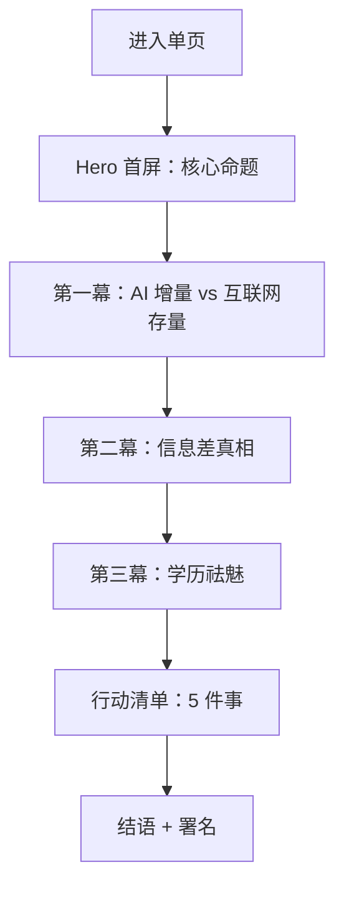

## 1. 产品概述

一个面向大学生的 AI 时代生存指南单页 HTML 文档，通过三个核心观点（AI 是增量市场 vs 互联网存量市场、AI 使用的信息差、学历贬值）系统论述"AI 时代大学生应该怎么做"，并给出可落地的行动建议。

- **目标用户**：在校大学生、即将进入大学的年轻人、关注 AI 趋势的青年
- **核心价值**：用清晰的论点、可视化对比和切实行动清单，帮读者破除焦虑，找到 AI 时代的能力杠杆点

## 2. 核心功能

### 2.1 用户角色
本产品为内容呈现型单页文档，无登录/多角色设计。

### 2.2 功能模块
单页 HTML 文档，由以下几个纵向叙事段落组成：
1. **首屏 Hero 区**：标题、副标题、阅读时长、核心金句
2. **第一幕：AI 是增量市场 vs 互联网是存量市场** — 对比图/对比卡片
3. **第二幕：AI 使用的信息差** — 数据可视化、阶层化展示
4. **第三幕：学历为什么不再那么重要** — 论证与案例
5. **行动清单：AI 时代大学生的 5 件事** — 行动卡
6. **结语 / 署名区**：鼓励性结语、日期、署名

### 2.3 页面细节
| 区域 | 模块 | 功能描述 |
|------|------|----------|
| Hero | 标题 + 副标题 + 阅读标记 | 强烈视觉冲击的第一屏，引出主题 |
| Hero | 滚动指示 | 暗示还有更多内容 |
| 第一幕 | 对比卡（互联网 / AI） | 用并列卡片呈现两者的本质差异 |
| 第一幕 | 关键数据点 | "100x 杠杆"、"全新增量"等关键数据 |
| 第二幕 | 信息差金字塔 | 可视化"少数人 vs 多数人"的认知差 |
| 第二幕 | 反共识金句 | "99% 的人以为 AI 还在尝鲜" |
| 第三幕 | 学历三问 | 用问答形式拆解学历逻辑 |
| 第三幕 | 案例时间线 | 一两个简短例子 |
| 行动清单 | 5 张行动卡 | 每张卡片一句话行动 + 解释 |
| 结语 | 终极金句 + 署名 | 收束全篇 |

## 3. 核心流程

用户进入页面 → Hero 抓住注意力 → 滚动阅读三个论据 → 看到行动清单 → 留下/分享。

## 4. 用户界面设计

### 4.1 设计风格
- **主色调**：深空黑 (#0A0A0A) + 暖白 (#F4F0E8) + 强调橙红 (#FF4D2E)
- **辅色**：电光蓝 (#3B82F6) 用于"AI 增量"，暗金 (#C9A961) 用于"传统学历"
- **字体**：
  - 标题：Fraunces（衬线、富有书卷气） 或 Playfair Display
  - 正文：Inter 或 系统无衬线（要求克制易读）
  - 中文：思源宋体 / 思源黑体（系统字体）
- **按钮/链接样式**：下划线悬停、箭头位移
- **布局**：垂直滚动单页，长段叙事 + 关键节点满屏
- **图标**：用 Unicode 几何符号 + 极简 SVG 线条，不使用 emoji

### 4.2 页面设计总览
| 区域 | UI 元素 |
|------|---------|
| Hero | 满屏大标题、阅读时间标记、缓慢浮动元素 |
| 第一幕 | 左右双栏对比卡 + 渐变背景切换 |
| 第二幕 | 阶梯式金字塔 + 数字滚动 |
| 第三幕 | 提问卡片 + 案例时间线（垂直线） |
| 行动清单 | 5 张编号卡片，悬停上浮 |
| 结语 | 居中金句 + 落款 |

### 4.3 响应式
桌面优先（1280px+ 主设计），向下兼容到 768px；移动端单列堆叠、字号自适应。

### 4.4 动效策略
- 首屏入场：标题字符逐个淡入（stagger 30ms）
- 滚动出现：IntersectionObserver 触发段落淡入
- 数字计数：进入视口后从 0 滚动到目标值
- 鼠标悬停：行动卡上浮 8px + 阴影加深
- 背景：微妙噪点纹理 + 渐变缓慢漂移
