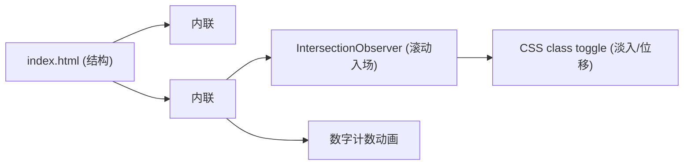

## 1. 架构设计

由于产品形态为单页静态内容展示，无需后端、数据库、复杂路由。采用纯静态 HTML + CSS + 原生 JavaScript 的最简方案，最大化加载速度与可移植性。



## 2. 技术说明

- **前端**：纯 HTML5 + CSS3 (Custom Properties + Grid + Flex) + 原生 JavaScript (ES2020)
- **字体**：Google Fonts 引入 Fraunces（标题）+ Inter（正文），中文走系统字体栈
- **图标**：内联 SVG 或 Unicode 字符
- **图片**：仅使用 [Image Generation API](https://trae-api-cn.mchost.guru) 生成的占位插图（可选，主体走纯排版）
- **构建工具**：无（直接打开 index.html 即可）
- **后端**：无
- **数据库**：无

## 3. 路由定义

单文件无路由。

| 路由 | 用途 |
|------|------|
| `/` 或 `index.html` | 整篇内容 |

## 4. API 定义

无后端 API。仅前端动画与滚动交互。

## 5. 服务端架构

无。

## 6. 数据模型

无。

## 7. 文件结构

```
/workspace
├── index.html              # 单文件成品
├── .trae/documents/
│   ├── prd.md
│   └── tech-architecture.md
```

## 8. 浏览器兼容

- Chrome / Edge / Safari / Firefox 最新两个大版本
- 不支持 IE
- 移动端 iOS Safari 14+ / Android Chrome 90+
